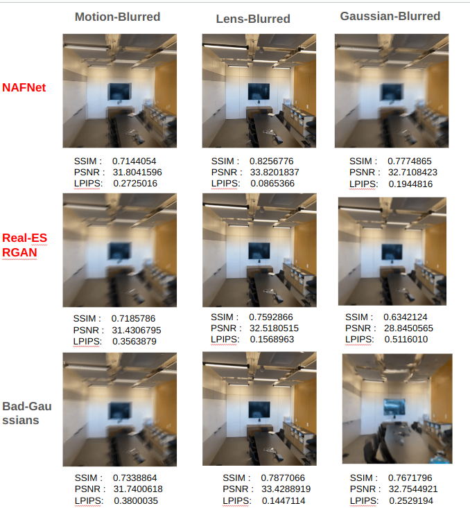

# Performance of Gaussian Splatting on Real and Syntheitc Deblurred Multi-view Image Dataset

## Overture
Modification of Gaussian Splatting pipeline to deal with blurred images can be very costly in terms of training latency. On the other hand, if one deblurs the images before pose estimation of COLMAP, then not only would lead to better pose estimation, but also the training time would be asymptotic to original Gaussian Splatting. What I am thinking is this:

|  |
|:--:|
| *Handling Gaussian Splatting to deal with blurring images, by making innovations before pose estimation, instead of Gaussian Splatting pipeline* |


So, in this course, I would like to propose three compositions.

* NAFNet+ Gaussian Splatting
* Real-ESRGAN + Gaussian Splatting
* Real-ESRGAN + NAFNet + Gaussian Splatting

For blurring, I consider both real and synthetic cases. For the synthetic blurring of images, for the purpose of observing deblurring performance, I am considering following three deblurring types:

* Gaussian Blur
* Lens Blur
* Motion Blur


## Setup
### COLMAP Installation
Follow the steps mentioned [here](https://github.com/superdianuj/colmap_installation_directs)


### CONDA environment setup
```code
conda create -n nafnet python=3.8 -y
conda activate nafnet
pip install gdown
conda install pytorch==1.13.1 torchvision==0.14.1 torchaudio==0.13.1 pytorch-cuda=11.7 -c pytorch -c nvidia
cd real_blur/NAFNet
pip install -r requirements.txt
pip install lpips
python setup.py develop --no_cuda_ext
cd ../..
```

```code 
conda create -n torcher python=3.8 -y
conda activate torcher
pip install gdown
conda install pytorch==1.13.1 torchvision==0.14.1 torchaudio==0.13.1 pytorch-cuda=11.7 -c pytorch -c nvidia
pip install lpips
pip install matplotlib seaborn
pip install BlurGenerator
pip install basicsr
cd real_blur/Real-ESRGAN
pip install -r requirements.txt
python setup.py develop
cd ../..
```


```code
conda create --name nerfstudio -y python=3.8
conda activate nerfstudio
python -m pip install --upgrade pip
pip install torch==2.0.1+cu117 torchvision==0.15.2+cu117 --extra-index-url https://download.pytorch.org/whl/cu117
conda install -c "nvidia/label/cuda-11.7.1" cuda-toolkit
pip install ninja git+https://github.com/NVlabs/tiny-cuda-nn/#subdirectory=bindings/torch
git clone https://github.com/nerfstudio-project/nerfstudio.git
cd nerfstudio
pip install --upgrade pip setuptools
pip install -e .
```


### Pretrained Deblurring model download
#### NAFNet
```code
conda activate torcher
cd real_blur/NAFNet/experiments/pretrained_models

python -c "
import gdown
try:
    url = 'https://drive.google.com/uc?id=14D4V4raNYIOhETfcuuLI3bGLB-OYIv6X'
    output = 'downloaded_file.zip'
    gdown.download(url, output, quiet=False)
except Exception as e:
    print(f'An error occurred: {str(e)}')
"
cd ../../../..
```


```code
conda activate torcher
cd synthetic_blur/NAFNet/experiments/pretrained_models

python -c "
import gdown
try:
    url = 'https://drive.google.com/uc?id=14D4V4raNYIOhETfcuuLI3bGLB-OYIv6X'
    output = 'downloaded_file.zip'
    gdown.download(url, output, quiet=False)
except Exception as e:
    print(f'An error occurred: {str(e)}')
"
cd ../../../..
```


##### Real-ESRGAN
```code
cd real_blur/Real-ESRGAN/weights
wget https://github.com/xinntao/Real-ESRGAN/releases/download/v0.2.5.0/realesr-general-x4v3.pth
cd ../../..
```


```code
cd synthetic_blur/Real-ESRGAN
wget https://github.com/xinntao/Real-ESRGAN/releases/download/v0.2.5.0/realesr-general-x4v3.pth
cd ../..
```

### Photogammetric images folder placement
Possible source of dataset: [here](https://www.kaggle.com/datasets/arenagrenade/llff-dataset-full) (clean images) and [here](https://drive.google.com/drive/folders/1_TkpcJnw504ZOWmgVTD7vWqPdzbk9Wx_) (real life blur case)
```code
# Copy the folder <images folder> within each subdirectory of this directory
```


### BAD-Gaussians

BAD-Gaussians can be swiftly implemented by following the commands [here](https://github.com/WU-CVGL/BAD-Gaussians), and using the conda environment as "nerfstudio" in above mentioned CONDA setup.


## Run

### Real Blur
```code
cd real_blur
chmod +x commands.sh
./commands.sh <images folder>
```


### Synthetic Blur

```code
cd synthetic_blur
chmod +x commands.sh
./commands.sh <images folder>
```


## Results

|  |
|:--:|
| *Comparison of novel views and metrics of Gaussian splatting variant (BAD-Gaussians) and simple GS + deblurring models (Training time= 15K epochs)* |

## Conclusion

Using deblurring models with Gaussian splatting is definitely a good idea as it leads to faithful novel views reconstruction as compared to BAD-Gaussians, with relatively modest metric improvement.
